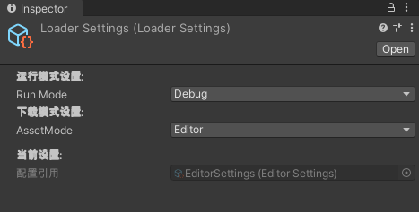
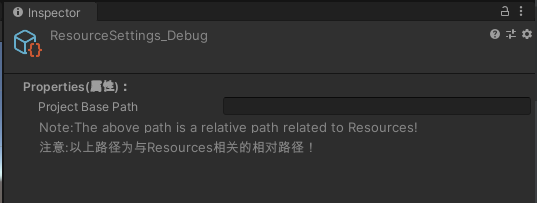
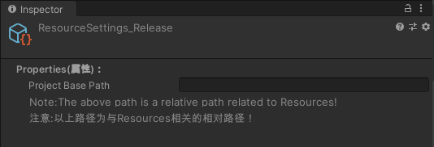
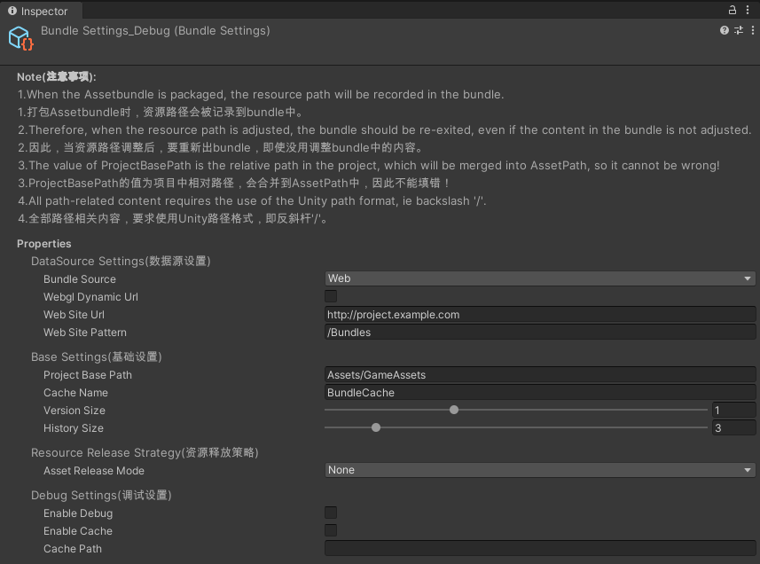
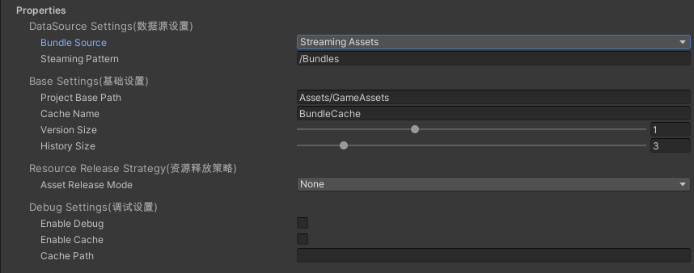
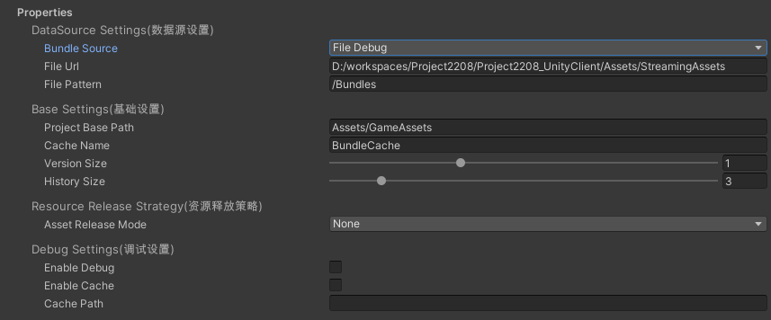

## 2. 加载管理模块(Loader) - 支持Resources、Editor、Assetbundle三种模式自由切换

+ **JLGames.GameDriver.Actions.Loader** 提供了加载器全部的功能支持。
+ **“Tools -> GameDriver -> Project -> Gen LoaderSettings”**提供了加载器配置文件的生成入口。

### 2.1 初始化

#### 2.1.1 生成配置资产
执行菜单 “Tools -> GameDriver -> Project -> Gen LoaderSettings”。  
在项目Assets/Resources下会生成 LoaderSettings.asset(可重命名) 文件。  
  
  

#### 2.1.2  按项目需求设置配置
LoaderSettings中共有5个可用配置，一个Editor模式， 两个Resource模式， 两个AssetBundle模式。  

+ Editor配置
  ProjectBasePath可以设置项目的资源查找的基础路径部分，在加载资源时可拼接到资源路径前。  
    
+ Resource配置
  ProjectBasePath可以设置项目的资源查找的基础路径部分，在加载资源时可拼接到资源路径前。  
     
+ AssetBundle配置

  + BundleSource 
    可选择Web、Streaming Assets、File Debug三种模式。  
    + Web 
      用于加载直接存入在站点上的AssetBundle资源。  
      Web Site Url 中填入站点Url。  
      Web Site Pattern 中填入Parttern路径。   
        
    + Streaming Assets 
      用于加载存放在项目StreamingAssets中的AssetBundle资源。  
      Streaming Parttern 中填入相对于StreamingAssets的相对路径。  
        
    + File Debug 
      用于加载本地文件系统中的AssetBundle资源，多用于调试。  
      File Url 中填入本机文件路径。  
      File Pattern 中填入与File Url相关的相对路径。   
         
  + Base Settings    
    主要是关于项目的Bundle目录信息的设置与加载时缓存信息的设置。  
    + Project Base Path 设置项目的Bundle目录路径
    + CacheName 设置缓存区的名称，这个可以自定义。
    + Version Size 设置每个Bundle资产在缓存中保留的版本数量。
    + History size 设置缓存区数量，每一个CacheName会产生一个缓存区。
  + Resource Release Strategy 
    可选择None、Time、Counter三种。  
    + None为不选择释放策略，释放Bundle与资产后产生的无效内存占用需要自己调用gc释放，该策略适合自行管理内存与gc时机。
    + Time为计时释放策略，会按照设定的时间周期调用gc。
         
    + Counter为计数释放策略， 当bundle加载资源到达设定值及倍数值时调用gc. 
         

#### 2.1.3 使用配置初始化加载器
使用以下API初始化加载器：  
+ 使用由[第一点]()生成的配置文件名称进行初始化。
```C#
LoaderManager.InitLoader(string loaderName, string settingsName);
```
+ 使用配置实例进行初始化。
```C#
LoaderManager.InitLoader(string loaderName, LoaderSettings settings);
```
+ 使用Loader静态类中有快捷初始化函数：
```C#
Loader.InitLoader(string settingsName);
```

#### 2.1.4 初始化Bundle版本信息
调用加载器实例中函数：  
```C#
InitVersion(LoaderDelegate.OnAssetLoaded<AssetBundleManifest> onVersionAssetBundleLoaded);
```
+ 函数回调为初始化版本结束后执行，内部可判断初始化结果：成功 或 失败。
+ 函数要求开启协程调用, 可以使用LoaderManager.Mono开启协程：
```C#
LoaderManager.Mono.StartCoroutine(LoaderManager.DefaultLoader.InitVersion(onVersionLoaded));
```

### 2.2 使用

#### 2.2.1 加载Bundle资产
在Bundle版本信息初始化完成后，才可以加载Bundle资产。  
加载器实现了IBundleLoader接口, 包含的函数与加载Bundle资产相关。  
加载Bundle资产要求使用协程，可以使用LoaderManager.Mono实例启用协程加载Bundle.  
```C#
LoaderManager.Mono.StartCoroutine(LoaderManager.DefaultLoader.LoadBundleAsync(bundleName, onBundleLoaded, autoRelease, unloadAllLoadedObjects))
```
+ bundleName: bundle资产名称。
+ onBundleLoaded: 执行结果回调, 内部可判断成功与否。
+ autoRelease: 指明在onBundleLoaded执行结束后是否释放bundle实例
+ unloadAllLoadedObjects: 指明在onBundleLoaded执行结束后是否释放从bundle实例中实例化的资源资产
+ 如果autoRelease为true, 在onoBundleLoaded中应该实例化全部要使用的资源资产。

#### 2.2.2 加载资源资产
在获得bundle实例的情况下， 可以从bundle实例中实例化出资源资产的实例， 然后再克隆使用。  
加载资源资产建议使用同步函数，不建议使用异步。 原因是Unity对于在协程内部开启协程支持得不友好， 层级过多(好像是16层)会出现无法预测的报错。  

IAssetLoader接口函数分四类：  
+ 单个资源资产加载(同步|异步)
```C#
/// <summary>
/// Load asset from bundle synchronously with relative path
/// 使用相对路径从Bundle中加载资源
/// </summary>
/// <param name="assetPath">资源路径</param>
/// <param name="bundle">资源包</param>
/// <typeparam name="T">资源类型</typeparam>
/// <returns></returns>
T LoadAssetSync<T>(string assetPath, AssetBundle bundle) where T : Object;

/// <summary>
/// Load asset from bundle synchronously with full path
/// 使用完整路径从Bundle中加载资源
/// The full path：refers to the relative path after removing ProjectBasePath
/// 完整路径：指的是去除ProjectBasePath后的相对路径
/// </summary>
/// <param name="fullPath">完整资源路径,忽略设置的ProjectBasePath</param>
/// <param name="bundle">资源包</param>
/// <typeparam name="T">资源类型</typeparam>
/// <returns></returns>
T LoadAssetSyncFull<T>(string fullPath, AssetBundle bundle) where T : Object; 

/// <summary>
/// Asynchronously load resources from bundle
/// 异步从资源包中加载资源
/// </summary>
/// <param name="assetPath">资源路径</param>
/// <param name="bundle">资源包</param>
/// <param name="onAssetLoaded">回调</param>
/// <typeparam name="T">资源类型</typeparam>
/// <returns></returns>
IEnumerator LoadAssetAsync<T>(string assetPath, AssetBundle bundle, LoaderDelegate.OnAssetLoaded<T> onAssetLoaded) where T : Object;
```

+ 批量资源资产加载(同步|异步)
```C#
/// <summary>
/// Synchronized load resources from bundle in batches
/// 同步批量从资源包中加载资源
/// </summary>
/// <param name="assetPaths">资源路径</param>
/// <param name="bundle">资源包</param>
/// <typeparam name="T">资源类型</typeparam>
/// <returns></returns>
T[] LoadAssetsSync<T>(string[] assetPaths, AssetBundle bundle) where T : Object;

/// <summary>
/// Synchronized load resources from bundle in batches
/// 同步批量从资源包中加载资源
/// </summary>
/// <param name="fullPaths">完整资源路径,忽略设置的ProjectBasePath</param>
/// <param name="bundle">资源包</param>
/// <typeparam name="T">资源类型</typeparam>
/// <returns></returns>
T[] LoadAssetsSyncFull<T>(string[] fullPaths, AssetBundle bundle) where T : Object;

/// <summary>
/// Batch asynchronously load resources from bundle
/// 异步从资源包中批量加载资源
/// </summary>
/// <param name="assetPaths">路径数组</param>
/// <param name="bundle">资源包</param>
/// <param name="onMultiAssetLoaded">回调</param>
/// <typeparam name="T"></typeparam>
/// <returns></returns>
IEnumerator LoadMulitAssetAsync<T>(string[] assetPaths, AssetBundle bundle, LoaderDelegate.OnMultiAssetLoaded<T> onMultiAssetLoaded)
where T : Object;
```

+ 单个子资源资产加载(同步|异步)
```C#
/// <summary>
/// Load sub-resources (sprites, prefabs, etc.)
/// 加载子资源(子图、预置等)
/// </summary>
/// <param name="path"></param>
/// <param name="subName"></param>
/// <param name="ab"></param>
/// <returns></returns>
Object LoadSubAssetSync(string path, string subName, AssetBundle ab);

/// <summary>
/// Load sub-resources (sprites, prefabs, etc.)
/// 加载子资源(子图、预置等)
/// </summary>
/// <param name="path"></param>
/// <param name="subName"></param>
/// <param name="type"></param>
/// <param name="ab"></param>
/// <returns></returns>
Object LoadSubAssetSync(string path, string subName, Type type, AssetBundle ab);

/// <summary>
/// Load sub-resources (sprites, prefabs, etc.)
/// 加载子资源(子图、预置等)
/// </summary>
/// <param name="path"></param>
/// <param name="subName"></param>
/// <param name="ab"></param>
/// <returns></returns>
T LoadSubAssetSync<T>(string path, string subName, AssetBundle ab) where T : Object;

/// <summary>
/// Load sub-resources (sprites, prefabs, etc.) from bundles asynchronously
/// 异步从资源包中加载加载子资源(子图、预置等)
/// </summary>
/// <param name="assetPath">资源路径</param>
/// <param name="subName"></param>
/// <param name="bundle">资源包</param>
/// <param name="onAssetLoaded">Callback(回调)</param>
/// <typeparam name="T">Resource type(资源类型)</typeparam>
/// <returns></returns>
IEnumerator LoadSubAssetAsync<T>(string assetPath, string subName, AssetBundle bundle, LoaderDelegate.OnAssetLoaded<T> onAssetLoaded)
where T : Object;
```

+ 批量子资源资产加载(同步|异步)
```C#
/// <summary>
/// Load all sub-resources (sprites, prefabs, etc.)
/// 加载子资源(子图、预置等)
/// </summary>
/// <param name="path"></param>
/// <param name="type"></param>
/// <param name="bundle"></param>
/// <returns></returns>
Object[] LoadSubAssetsSync(string path, Type type, AssetBundle bundle);

/// <summary>
/// Load all sub-resources (sprites, prefabs, etc.)
/// 加载子资源(子图、预置等)
/// </summary>
/// <param name="path"></param>
/// <param name="bundle"></param>
/// <typeparam name="T"></typeparam>
/// <returns></returns>
T[] LoadSubAssetsSync<T>(string path, AssetBundle bundle) where T : Object;

/// <summary>
/// Load sub-resources (sprites, prefabs, etc.)
/// 加载子资源(子图、预置等)
/// </summary>
/// <param name="path"></param>
/// <param name="subNames"></param>
/// <param name="bundle"></param>
/// <returns></returns>
Object[] LoadSubAssetsSync(string path, string[] subNames, AssetBundle bundle);

/// <summary>
/// Load sub-resources (sprites, prefabs, etc.)
/// 加载子资源(子图、预置等)
/// </summary>
/// <param name="path"></param>
/// <param name="subNames"></param>
/// <param name="type"></param>
/// <param name="ab"></param>
/// <returns></returns>
Object[] LoadSubAssetsSync(string path, string[] subNames, Type type, AssetBundle ab);

/// <summary>
/// Load sub-resources (sprites, prefabs, etc.)
/// 加载子资源(子图、预置等)
/// </summary>
/// <param name="path"></param>
/// <param name="subNames"></param>
/// <param name="bundle"></param>
/// <typeparam name="T"></typeparam>
/// <returns></returns>
T[] LoadSubAssetsSync<T>(string path, string[] subNames, AssetBundle bundle) where T : Object;

/// <summary>
/// Load sub-resources (sprites, prefabs, etc.) from bundles asynchronously
/// 异步从资源包中加载加载子资源(子图、预置等)
/// </summary>
/// <param name="assetPath">资源路径</param>
/// <param name="buundle">资源包</param>
/// <param name="onAssetsLoaded">Callback(回调)</param>
/// <typeparam name="T">Resource type(资源类型)</typeparam>
/// <returns></returns>
IEnumerator LoadSubAssetsAsync<T>(string assetPath, AssetBundle buundle, LoaderDelegate.OnMultiAssetLoaded<T> onAssetsLoaded)
where T : Object;
```

+ 更多用法请参考示例、API或源码。
  
### 2.3 示例
GameDriver/Samples/Loader  
  