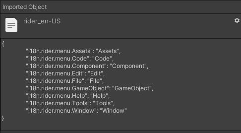
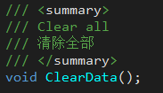
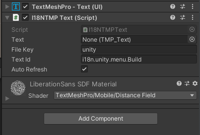
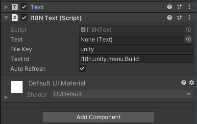
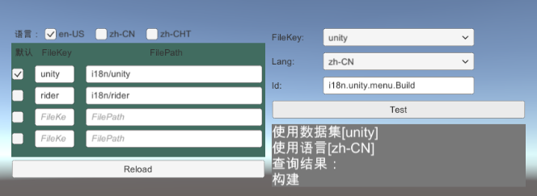

## 3. 国际化(i18n) - 轻量级国际化解决方案

+ **JLGames.GameDriver.Actions.i18n** 提供了国际化模块全部的功能支持。
+ 建议使用 [BabelEdit](https://www.codeandweb.com/babeledit) 创作管理数据集。

### 3.1 初始化
按照以下流程，为您的项目配置国际化功能：  

#### 3.1.1 理清楚项目需要支持的国际化语言种类
这里以 **英文[英文]** 、**中文[简体]**、**中文[繁体]** 举例。  

#### 3.1.2 准备国际化数据文件
支持多个文件集，这里以两个文件集 **unity**、**rider** 举例。  
  
数据格式以 Key-Value 形式：  
  
当前测试数据集使用 Jetbrains 的 [BabelEdit](https://www.codeandweb.com/babeledit) 创作，这是一个不错的工具。  

#### 3.1.3 向注册表注册语言。
调用 I18NRegister 实例中的 RegisterLang 函数：  
  
+ langName 与 langSuffix 建议一样。
+ default=true 时设置当前语言为默认语言。
  
#### 3.1.4 向注册表注册文件集加载信息
调用 I18NRegister 实例中的 RegisterFile 函数：  
  
+ fileKey 用于标识当前设置的文件集。
+ default=truej时设置当前文件集为默认文件集。

#### 3.1.5 根据注册表，加载数据到管理器中
调用 II18NManager 实例中的 LoadData 函数：  
`I18NManagerShared.Manager.LoadData();`  
  

**注意**：如果在过去已经执行为加载数据，那您应该先清除旧数据：  
`I18NManagerShared.Manager.ClearData();`  
  

### 3.2 使用

#### 3.2.1 使用 I18NTMPText 组件，为TMP_Text增加国际化支持。
为TMP_Text节点增加 I18NTMPText 组件   
  
+ File Key 为注册文件集时的fileKey参数。
+ Auto Refresh 选中时，管理器重新加载数据后会自刷新。
  
#### 3.2.2 使用 I18NText 组件，为Text增加国际化支持。
为Text节点增加 I18NText 组件   
  
+ File Key 为注册文件集时的fileKey参数。
+ Auto Refresh 选中时，管理器重新加载数据后会自刷新。

#### 3.2.3 在代码中读取国际化数据。
`I18NManagerShared.Manager.GetValue(id, fileKey, lang);`  
  

### 3.3 示例
GameDriver/Samples/i18n  
  