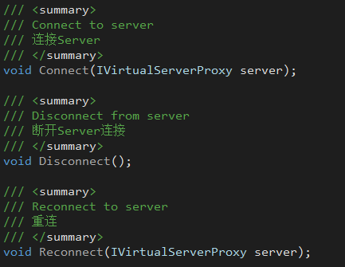
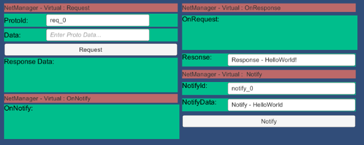

## 4. Network management extension module (NetManager)
Easy-to-use network link management module  
+ **JLGames.GameDriver.CSharp.Net** provides a C# package for Socket API, which enables developers to develop protocols such as TCP, UDP, HTTP(HTTPS), WebSocket(WebSockets) on the same set of APIs.
+ **JLGames.GameDriver.CSharp.Net** also provides support and extension for data packing and unpacking.
+ Management of link references is available in **JLGames.GameDriver.Games.NetManager**.
+ Extended support for stand-alone servers in **JLGames.GameDriver.Games.NetManager.Virtual**, which can simulate the behavior of server protocol capture and logic processing without an actual network connection.

### 4.1 Use of VirtualServer

#### 4.1.1 Instantiate and add to NetManager management
````C#
var server = new VirtualServer("server", "none");
NetManager.Shared.Register(server, true);
````
  
Objects added to NetManager can be obtained by name.  

#### 4.1.2 Registering extensions
````C#
server.RegisterExtension(VirtualReqIds.Id0, OnRequestHandler);
````
  
+ protoId: Protocol ID, defined by the developer.
+ onProtoRequestHandler: Response function, corresponding to the response management logic of the protocol number.

#### 4.1.3 Protocol response
Response delegate declaration: `VirtualServerDelegate.OnProtoRequestHandler`
  
+ server: IVirtualServer instance, which is mainly used in the function to send broadcast notifications of protocol results and data.
+ protoId: protocol number
+ data: the data sent when the protocol requests

#### 4.1.4 Message Push
+ The INotifyServer interface contains function declarations for message push.
  
+ The IMaterialNotifyServer interface contains function declarations for pushing messages related to material data.
  
+ The server instance in the response delegate `VirtualServerDelegate.OnProtoRequestHandler` has implemented the INotifyServer and IMaterialNotifyServer interfaces, and realizes the data broadcasting function by calling the message push function.

### 4.2 Use of VirtualClient

#### 4.2.1 Instantiate and add to NetManager management.
````C#
var client = new VirtualClient("client", "none");
NetManager.Shared.Register(client, true);
````
  
Objects added to NetManager can be obtained by name.  

#### 4.2.2 Connecting to the server
````C#
var serverProxy = NetManager.Shared.GetServer<IVirtualServer>("server") as IVirtualServerProxy;
client.Connect(serverProxy);
````
  
+ Get the server proxy (actually the VirtualServer object) from the manager.
+ The connection proxy function is Connect.
+ The function to cancel the proxy connection is Disconnect.

#### 4.2.3 Monitor request response, monitor message push
The monitoring function is built under the event mechanism:  
````C#
client.AddEventListener(VirtualClientEvents.EventResponse, OnClientResponse);
client.AddEventListener(VirtualClientEvents.EventNotify, OnClientNotify);
````
  

#### 4.2.4 Send message request
Use the Request function under the interface IVirtualClient to send a message request to the server.  
````C#
NetManager.Shared.GetClient<IVirtualClient>("client").Request(protoId, m_InputRequestData.text.Trim());
````
  

### 4.3 Example
GameDriver/Samples/NetManager  
  