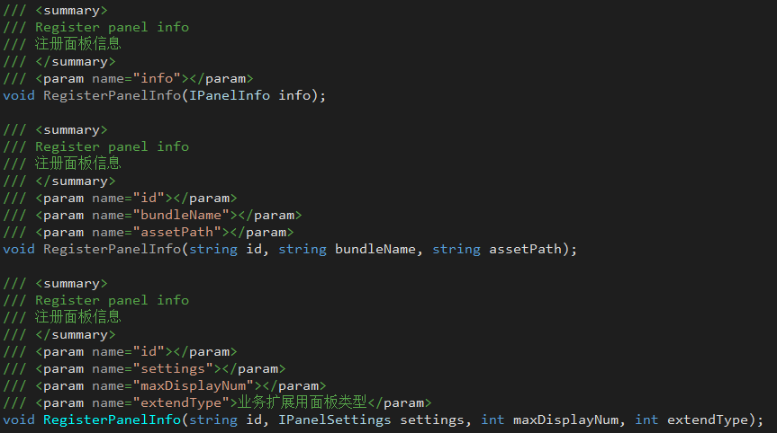

## 6. 面板管理模块(PanelManager)
+ **JLGames.GameDriver.Actions.Layer** 提供了容器层级管理功能。
+ **JLGames.GameDriver.Games.PanelManager** 提供了面板管理功能。
+ 面板管理模块的使用流程： 注册 -> 展示 -> 关闭
+ 若要缓存面板不销毁，建议把面板移出屏幕外。 

### 6.1 注册信息

#### 6.1.1 注册层容器信息
```C#
PanelManagerShared.Manager.Register.RegisterLayer(containerName, tranContainer, isDefault);
```
  
+ layerName: 为注册的层信息指定一个名称，与layer的name属性无关。
+ layer: 层的Transform组件引用.
+ default: 是否设置为默认，如果为true，当打开面板时不指定层名称，则选择默认层。

#### 6.1.2 注册背景处理信息
```C#
PanelManagerShared.Manager.Register.RegisterBackground(backgroundKey, backgroundOrigin, backgroundScript);
```
  
+ key: 为注册的背景信息指定一个key， 用于标识信息的唯一性。
+ origin: 背景的预制件, 当展示面板时, 克隆预制件添加到面板容器的最底层。
+ script: 处理背景逻辑的脚本组件的类名(包含命名空间)。

#### 6.1.3 注册动画信息
```C#
PanelManagerShared.Manager.Register.RegisterAnimator(animKey, animAnimator);
```
  
+ key: 为注册的动画信息指定一个Key， 用于标识信息的唯一性。
+ animator: 动画RuntimeAnimatorController组件。

#### 6.1.4 设置面板的基础容器
```C#
PanelManagerShared.Manager.Register.RegisterPanelContainer(container);
```
  
+ container: 面板容器的预制件，当展示面板时, 克隆预制件作为面板根节点添加到展示层中, 面板的实际内容任务子节点添加到面板容器中。

#### 6.1.5 注册面板信息
```C#
PanelManagerShared.Manager.Register.RegisterPanelInfo(panelId, settings, maxDisplayNum, extendType);
```
  
+ 面板信息最终以IPanelInfo的实例保存起来用于查找与展示。
+ 项目使用时，应该读取项目面板的配置信息，并注册进来。

#### 6.1.6 使用PanelManagerRegister组件，可以同时处理层容器、背景、动画以及面板信息的注册功能
  

#### 6.1.7 注意
**背景注册** 和 **动画注册** **非必要**，当面板信息中有关联要求时才注册。  

### 6.2 展示面板

#### 6.2.1 通过面板id弹出面板, 可选择指定面板层容器。
```C#
PanelManagerShared.Manager.ShowPanel(panelId);
```
  

#### 6.2.2 通过面板id弹出面板, 并传入参数对象, 可选择指定面板层容器。
```C#
PanelManagerShared.Manager.ShowPanel(panelId, panelParams);
```
  

### 6.3 高级应用

#### 6.3.1 自定义注册器
IPanelManager中的注册器可自定义，只要实现IPanelRegiester接口即可。  
  

#### 6.3.2 自定义加载器
IPanelManager中的加载器可自定义，只要实现IIPanelLoaderAdapter接口即可。  
  

#### 6.3.3 设置面板展示时机
IPanelManger中的SetShowMoment可以设置面板展示时机(立即展示|帧结束展示)  
  
+ 立即展示
  代码执行时，马上进行加载处理。当资源准备完成后立即添加面板到显示节点。  
+ 帧结束展示
  代码执行时，马上进行加载处理。当资源准备完成后，开启协程，等待WaitForEndOfFrame后添加面板到显示节点。  

#### 6.3.4 IPanelSettings说明
IPanelSettings实例为面板注册时保存的面板配置信息接口，包含资源配置、背景配置和动画配置。  

##### 6.3.4.1 资源配置
IPanelAssetSettings实例  
主要配置属性：BundleName、AssetPath、MainScriptName、MainScriptParams  
  
+ BundleName
  面板资源所在的Assetbundle的名称  
+ AssetPath
  面板资源处于Assetbundle中的路径  
+ MainScriptName
  面板如果有主脚本， 则返回主脚本的完整类名(包含命名空间)。  
  没有主脚本则返回null或空字符串。  
+ MainScriptParams
  当MainScriptName存在实现IParamsPanel接口时生效，为函数SetPanelStringParams的传入参数。  

##### 6.3.4.2 背景配置
IPanelBackgroundSettings实例  

+ 基础参数
  + OriginKey
    背景信息注册时指定的key  
  + OriginInfo
    通过背景信息注册时指定的key，查找出注册信息，取其中的origin预制件。  
  + Mode
    背景模式支持四种：None、Color、Image、Screenshot  
    + None
    依赖系数：无  
    + Color
    依赖系数：Color  
    + Image
    依赖系数：ImageSprite、ImageBundle、ImagePath、BlurFactor  
    + Screenshot
    依赖系数：ScreenshotFactor  
+ 模式相关参数
  + Color [Mode=Color时生效]
    背景颜色值, 用于设置背景颜色值  
  + ImageSprite [Mode=Image时生效]
    两种情况：ImageSprite不为空、ImageSprite为空。  
    + ImageSprite不为空
      忽略ImageBundle和ImagePath参数，使用ImageSprite填充。  
    + ImageSprite为空
      通过Register中的加载器，使用ImageBundle和ImagePath加载Sprite填充。  
  + ImageBundle和ImagePath [Mode=Image时生效]
    当ImageSprite为空时使用，用回加载Sprite资源。  
  + BlurFactor [Mode=Image时生效]
    模糊系数：[0,1]  
  + ScreenshotFactor [Mode=Screenshot时生效]
    截屏图像模糊系数  

##### 6.3.4.3 动画配置
IPanelAnimSettings实例  
  
+ OpenKey
  动画信息注册时使用的key, 用于查找动画  
+ OpenState
  动画Animator中的状态名称，用于播放指定动画  
+ CloseKey
  动画信息注册时使用的key, 用于查找动画  
+ CloseState
  动画Animator中的状态名称，用于播放指定动画  

#### 6.3.5 面板功能扩展
现阶段有4个接口与面板功能扩展相关：  
IInitPanel、IParamsPanel、IRefreshPanel、IDisposePanel  
**注意**：IShowPanel、IClosePanel已**弃用**。  
+ IInitPanel
  用于面板初始化，调用时机在OnEnable之后  
    
+ IParamsPanel
  用于面板注入参数。  
    
  
  + SetPanelObjectParams 
    当调用ShowPanel时传入参数后被触发调用。  
  + SetPanelStringParams
    触发要求为同时具备以下两个条件：  
    1. 调用ShowPanel时没有传入参数。
    2. 注册面板信息时IPanelAssetSettings配置中MainScriptParams不为空。 传入参数为MainScriptParams的值。

+ IRefreshPanel
  用于面板刷新逻辑不适合放在Start或Awake中时使用。  
    
+ IDisposePanel
  当面板即将被销毁前调用，用于执行释放行为。  
    

### 6.4 示例
GameDriver/Samples/Panel  
  