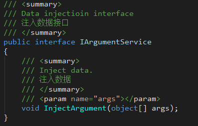
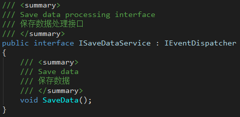
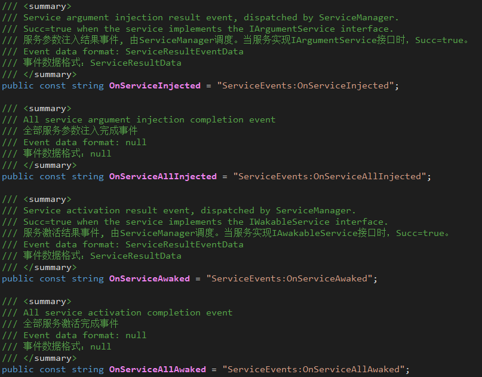
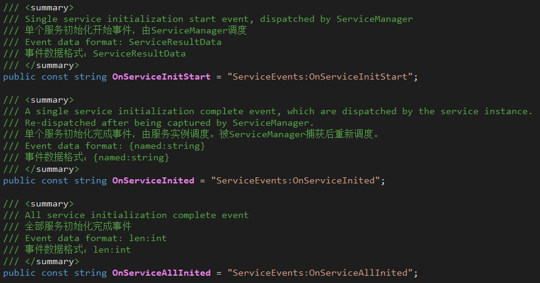
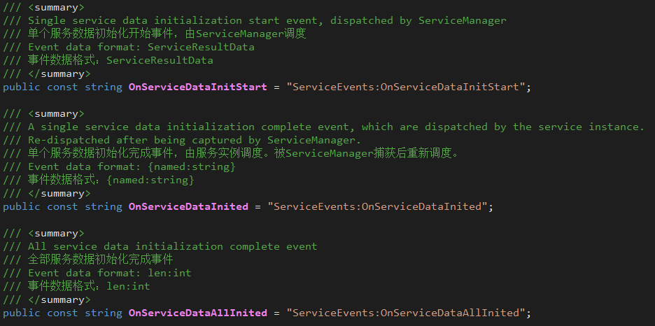
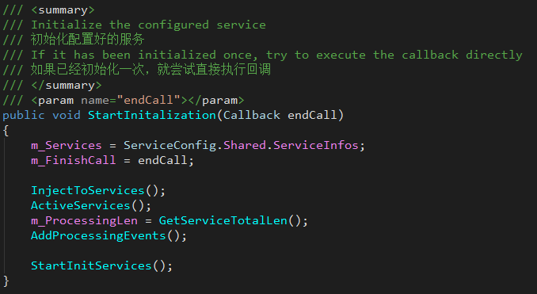
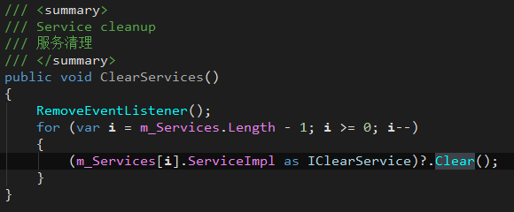
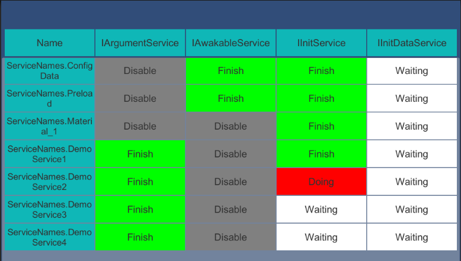

## 7. 服务框架(Service)
+ **JLGames.GameDriver.CSharp.Service** 提供了服务框架的基础接口与行为规范。
+ **JLGames.GameDriver.Actions.Service** 提供了针对Unity的服务配置资产(**未启用**)。
+ **JLGames.GameDriver.Games.Service** 提供了常用的服务功能。

### 7.1 设计目的
+ 实现业务模块逻辑分离
  + 不同业务间的逻辑分离
  + 同一业务下数据与显示的逻辑分离
+ 规范化业务模块的扩展支持
+ 统一跨业务行为调用的规范

### 7.2 设计思路
+ 按照IOC思想，扩展业务服务以注入的形式加入到框架管理。
+ 按照游戏引擎的设计思路， 给扩展业务服务加入了固定时机调用的接口函数，用于服务内部的初始化数据、释放数据或特殊逻辑实现。
+ 全部扩展服务都由框架进行管理，方便于初始化、更新、释放的统一处理。

### 7.3 接口说明

#### 7.3.1 服务基础
+ IService
  只有实现的IService接口的类，才能识别为服务并加入到框架管理。  
  ServiceName属性返回服务名称，要求具有**唯一性**。  
+ IEventDispatcher
  服务的时机管理依赖于[事件模块]()，因此服务实现类要求实现IEventDispatcher接口。  
+ ServiceBase
  实现服务类的一些必要功能，可用于继承。  
+ IProgressingService
  提供**进度更新**的服务接口。  
  当服务实例抛出**ServiceEvents.OnServiceProcessing**事件后触发一次进度更新。  
  服务实例要求提供**进度总量**与**进度当前量**的属性函数。  
    

#### 7.3.2 服务初始化相关
执行时机：IArgumentService -> IAwakableService -> IInitService  
+ IArgumentService
  提供**参数注入**的服务接口。  
  函数执行完成代表**注入参数**这一过程结束。  
    
+ IAwakableService
  提供**激活**逻辑的服务接口。  
  函数执行完成代表**激活**这一过程结束。  
    
+ IInitService
  提供**初始化**逻辑的服务接口。  
  当服务实例抛出**ServiceEvents.OnServiceInited**事件后代表**初始化**这一过程结束.  
    
+ IInitDataService
  提供**数据初始化**逻辑的服务接口。  
  当服务实例抛出**ServiceEvents.OnServiceDataInited**事件后代表**数据初始化**这一过程结束.  
    

#### 7.3.3 管理调度相关
+ IClearService
  提供**清理**逻辑的服务接口。  
  多用于数据重置、事件移除等逻辑。  
  函数执行完成代表清理这一过程结束。  
    
+ ILoadDataService
  提供**数据加载**逻辑的服务接口。  
  当服务实例抛出**ServiceEvents.OnServiceLoaded**事件后代表**数据加载**这一过程结束.  
    
+ ISaveDataService
  提供**数据保存**逻辑的服务接口。  
  当服务实例抛出**ServiceEvents.OnServiceSaved**事件后代表**数据保存**这一过程结束.  
    

#### 7.3.4 事件说明

##### 7.3.4.1 进度更新相关事件
  
+ ServiceEvents.OnServiceProcessing
  + 调度主体：实现了IProgressingService接口的服务实例
  + 调度时机：有必要告知监听者更新进度时。
+ ServiceEvents.OnInitializationProcessing
  + 调度主体：ServiceManager
  + 调度时机：调用StartInitalization到endCall初始执行期间，捕获到OnServiceProcessing、OnServiceInited、OnServiceDataInited三类事件时调度。
+ ServiceEvents.OnInitializationFinish
  + 调度主体：ServiceManager
  + 调度时机：调用StartInitalization结束时，在endCall执行之后。

##### 7.3.4.2 服务准备相关事件
  
调度顺序：OnServiceInjected > OnServiceAllInjected > OnServiceAwaked > OnServiceAllAwaked  
+ ServiceEvents.OnServiceInjected
  + 调度主体：ServiceManager
  + 调度时机：调用StartInitalization期间
+ ServiceEvents.OnServiceAllInjected
  + 调度主体：ServiceManager
  + 调度时机：调用StartInitalization期间，全部实现IArgumentService的服务处理完成后。
+ ServiceEvents.OnServiceAwaked
  + 调度主体：ServiceManager
  + 调度时机：调用StartInitalization期间
+ ServiceEvents.OnServiceAllAwaked
  + 调度主体：ServiceManager
  + 调度时机：调用StartInitalization期间，全部实现IAwakableService的服务处理完成后。

##### 7.3.4.3 服务初始化相关事件
  
  
调度顺序：OnServiceInitStart > OnServiceInited > OnServiceAllInited > OnServiceDataInitStart > OnServiceDataInited > OnServiceDataAllInited
+ ServiceEvents.OnServiceInitStart
  + 调度主体：ServiceManager
  + 调度时机：调用StartInitalization期间，处理每一个服务关于IInitService接口行为之前。
+ ServiceEvents.OnServiceInited
  + 调度主体：实现IInitService的服务实例、ServiceManager
  + 调度时机：实现IInitService的服务实例处理Init行为完成后；ServiceManager捕获前者事件后重新调度。
+ ServiceEvents.OnServiceAllInited
  + 调度主体：ServiceManager
  + 调度时机：调用StartInitalization期间，全部实现IInitService的服务处理完成后。
+ ServiceEvents.OnServiceDataInitStart
  + 调度主体：ServiceManager
  + 调度时机：调用StartInitalization期间，处理每一个服务关于IInitDataService接口行为之前。
+ ServiceEvents.OnServiceDataInited
  + 调度主体：实现IInitDataService的服务实例、ServiceManager
  + 调度时机：实现IInitDataService的服务实例处理InitData行为完成后；ServiceManager捕获前者事件后重新调度。
+ ServiceEvents.OnServiceDataAllInited
  + 调度主体：ServiceManager
  + 调度时机：调用StartInitalization期间，全部实现IInitDataService的服务处理完成后。

##### 7.3.4.4 数据加载相关事件
  
+ ServiceEvents.OnServiceDataLoadStart
  + 调度主体：ServiceManager
  + 调度时机：调用LoadServicesData期间，处理每一个服务关于ILoadDataService接口行为之前。
+ ServiceEvents.OnServiceDataLoaded
  + 调度主体：实现ILoadDataService的服务实例、ServiceManager
  + 调度时机：实现ILoadDataService的服务实例处理LoadData行为完成后；ServiceManager捕获前者事件后重新调度。
+ ServiceEvents.OnServiceDataAllLoaded
  + 调度主体：ServiceManager
  + 调度时机：调用LoadServicesData期间，全部实现ILoadDataService的服务处理完成后。

##### 7.3.4.5 数据保存相关事件
  
+ ServiceEvents.OnServiceDataSaveStart
  + 调度主体：ServiceManager
  + 调度时机：调用SaveServicesData期间，处理每一个服务关于ISaveDataService接口行为之前。
+ ServiceEvents.OnServiceDataSaved
  + 调度主体：实现ISaveDataService的服务实例、ServiceManager
  + 调度时机：实现ISaveDataService的服务实例处理SaveData行为完成后；ServiceManager捕获前者事件后重新调度。
+ ServiceEvents.OnServiceDataAllSaved
  + 调度主体：ServiceManager
  + 调度时机：调用SaveServicesData期间，全部实现ISaveDataService的服务处理完成后。

### 7.4 如何使用框架
在获取服务使用前，必须先注册到框架管理，然后初始化后才能使用。这是为了确保数据已经完整地处理完成。  

#### 7.4.1 把服务注册到框架管理
通过调用ServiceConfig实例中的AddConfig函数，能把服务注册到框架管理中去。  
`ServiceConfig.Shared.AddConfig(new ServiceInfo(serviceName, serviceImpl, args));`  
  
**建议**：  
1. 使用一个专门处理注册服务的类管理注册逻辑。如示例中的ServiceRegister。
2. 注册逻辑调用应该保证唯一。

#### 7.4.2 服务初始化
通过调用ServiceManager实例中的StartInitalization函数，开始初始化。  
**注意**：初始化开始后不应该重复调用。  
  

#### 7.4.3 服务调用
在全部服务初始完成后，通过调用ServiceConfig中的GetService函数，可取得服务实例。  
ServiceConfig中获取服务实例的函数有多个，但最终调用的都是GetService函数。  
  
**建议**：  
1. 使用一个专门管理获取服务实例的类管理获取逻辑。如示例中的ServiceCenter。

#### 7.4.4 服务清理
当游戏要实现软重启时，有必要重置全部的服务再重新初始化。  
通过调用ServiceManager中的ClearServices，可实现全部服务的重置。  
只有实现IClearService接口的服务才会执行重置逻辑。  
  
  
**建议**：  
1. 每个服务都建议实现IClearService接口。
2. 在IClearService接口中的Clear函数中把事件监听也全部清除。

### 7.5 示例
GameDriver/Samples/Service  
  
  
示例中的服务说明：  
+ ConfigDataService
  1. 使用ExcelExport导出了Excle表头和数据。
  2. cfg.asset是DirFilesIndex资产管理器，用于管理Excel的Json数据的路径。
  3. 使用内置的Loader加载cfg.asset和Json文件，并缓存起来。
  4. Init处理完成。
+ PreloadService
  1. 使用PreloadSettings管理预加载资源的配置信息。
  2. 使用内置的Loader加载PreloadSettings资产。
  3. 根据PreloadSettings配置信息，加载资源。
  4. Init处理完成。
+ ResourceService
  材料数据框架下的服务实现。  
  1. 从ConfigDataService服务中读取配置。
  2. 通过配置初始化。
  3. Init处理完成。
  4. 模拟用户数据的生成。
  5. InitData处理完成。
+ DemoService
  样板服务，模拟了通过注入参数，在同一个服务逻辑下表现不同的功能。  