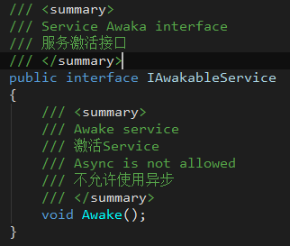
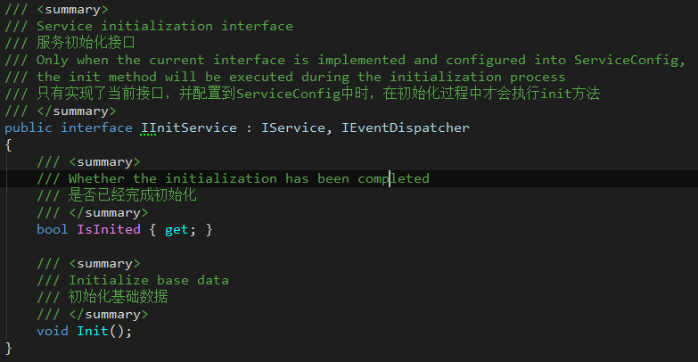
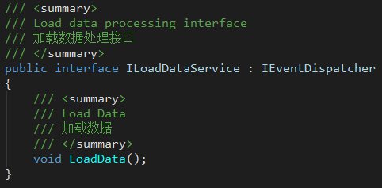
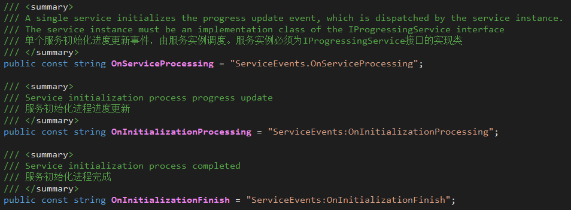
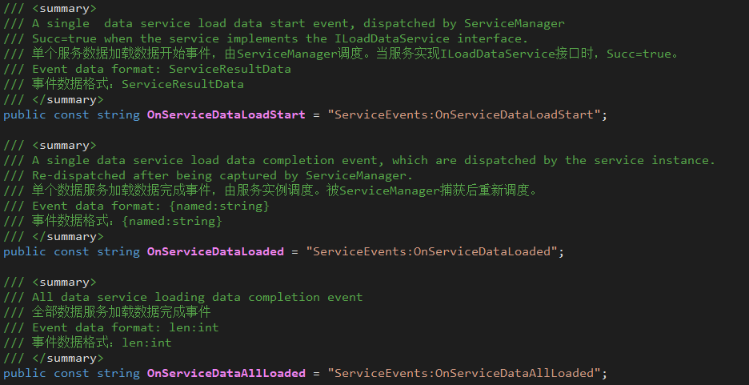
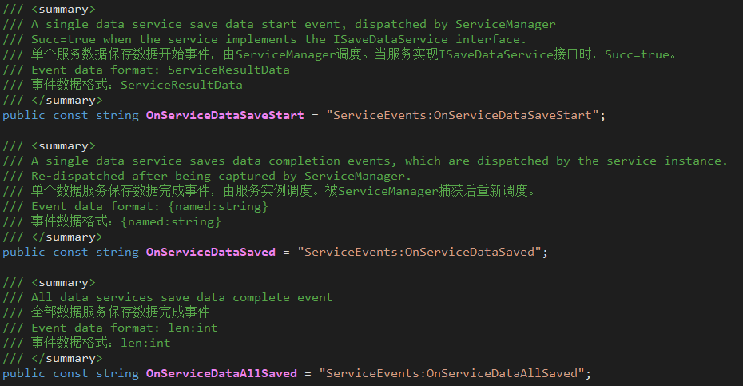
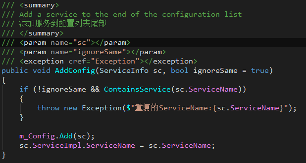
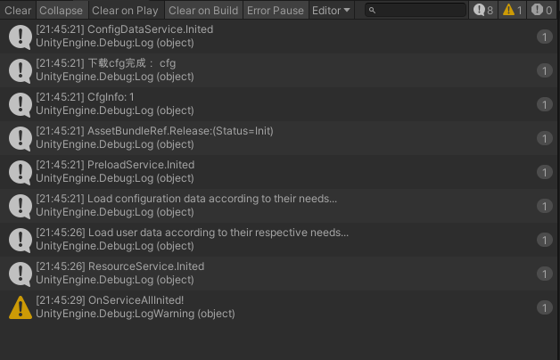

## 7. Service Framework (Service)
+ **JLGames.GameDriver.CSharp.Service** provides the basic interface and behavior specification of the service framework.
+ **JLGames.GameDriver.Actions.Service** provides service configuration assets for Unity (**not enabled**).
+ **JLGames.GameDriver.Games.Service** provides common service functions.

### 7.1 Design Purpose
+ Realize logical separation of business modules
  + Logical separation between different businesses
  + Logical separation of data and display under the same business
+ Extended support for normalized business modules
+ Unify the specification of cross-business behavior calls

### 7.2 Design Ideas
+ According to the idea of IOC, extended business services are added to the framework management in the form of injection.
+ According to the design idea of the game engine, an interface function called at a fixed timing is added to the extended business service, which is used for initializing data, releasing data or special logic implementation inside the service.
+ All extension services are managed by the framework, which is convenient for unified processing of initialization, update and release.

### 7.3 Interface description

#### 7.3.1 Service Basics
+ IService
  Only the class that implements the IService interface can be identified as a service and added to the framework management.  
  The ServiceName property returns the service name, which is required to be **unique**.  
+ IEventDispatcher
  The timing management of the service depends on the [event module](), so the service implementation class is required to implement the IEventDispatcher interface.  
+ ServiceBase
  Implement some necessary functions of the service class, which can be used for inheritance.  
  + IPProgressingService
  Provides a service interface for **progress update**.  
  Triggers a progress update when the service instance throws the **ServiceEvents.OnServiceProcessing** event.  
  The service instance requires the attribute functions of **total progress** and **current progress**.  
    

#### 7.3.2 Service initialization related
Execution timing: IArgumentService -> IAWakableService -> IInitService  
+ IArgumentService
  Provides a service interface for parameter injection  
  The completion of the function execution represents the end of the process of **injecting parameters**.  
    
+ IAWakableService
  A service interface that provides **activation** logic.  
  The completion of the function execution represents the end of the **activation** process.  
    
+ IInitService
  A service interface that provides **initialization** logic.  
  When the service instance throws the **ServiceEvents.OnServiceInited** event, it means the **initialization** process ends.  
    
+ IInitDataService
  A service interface that provides **data initialization** logic.  
  When the service instance throws the **ServiceEvents.OnServiceDataInited** event, it means the **data initialization** process ends.  
    

#### 7.3.3 Management scheduling related
+ IClearService
  A service interface that provides **cleanup** logic.  
  Mostly used for data reset, event removal and other logic.  
  The completion of the function execution means the end of the cleanup process.  
    
+ ILoadDataService
  Provides a service interface for data loading logic.  
  When the service instance throws the **ServiceEvents.OnServiceLoaded** event, it means the **data loading** process ends.  
    
+ ISaveDataService
  Provides a service interface for **data storage** logic.  
  When the service instance throws the **ServiceEvents.OnServiceSaved** event, it means the **data saving** process ends.  
    

#### 7.3.4 Event Description

##### 7.3.4.1 Progress update related events
  
+ ServiceEvents.OnServiceProcessing
  + Scheduling body: a service instance that implements the IProgressingService interface
  + Scheduling timing: when it is necessary to inform the listener of the update progress.
+ ServiceEvents.OnInitializationProcessing
  + Scheduling subject: ServiceManager
  + Scheduling timing: During the initial execution period from StartInitalization to endCall, it is scheduled when three events of OnServiceProcessing, OnServiceInited, and OnServiceDataInited are captured.
+ ServiceEvents.OnInitializationFinish
  + Scheduling subject: ServiceManager
  + Scheduling timing: when the call to StartInitalization ends, after the execution of endCall.

##### 7.3.4.2 Service preparation related events
  
Dispatching order: OnServiceInjected > OnServiceAllInjected > OnServiceAwaked > OnServiceAllAwaked  
+ ServiceEvents.OnServiceInjected
  + Scheduling subject: ServiceManager
  + Scheduling timing: during the call to StartInitalization
+ ServiceEvents.OnServiceAllInjected
  + Scheduling subject: ServiceManager
  + Scheduling timing: During the call to StartInitalization, all services that implement IArgumentService are processed.
+ ServiceEvents.OnServiceAwaked
  + Scheduling subject: ServiceManager
  + Scheduling timing: during the call to StartInitalization
+ ServiceEvents.OnServiceAllAwaked
  + Scheduling subject: ServiceManager
  + Scheduling timing: During the call to StartInitalization, after all the services that implement IAWakableService are processed.

##### 7.3.4.3 Service initialization related events
  
  
Dispatching order: OnServiceInitStart > OnServiceInited > OnServiceAllInited > OnServiceDataInitStart > OnServiceDataInited > OnServiceDataAllInited  
+ ServiceEvents.OnServiceInitStart
  + Scheduling subject: ServiceManager
  + Scheduling timing: During the call to StartInitalization, process each service before the behavior of the IInitService interface.
+ ServiceEvents.OnServiceInited
  + Scheduling subject: service instance, ServiceManager that implements IInitService
  + Scheduling timing: After the service instance that implements IInitService handles the Init behavior; ServiceManager captures the former event and reschedules it.
+ ServiceEvents.OnServiceAllInited
  + Scheduling subject: ServiceManager
  + Scheduling timing: During the call to StartInitalization, after all the services that implement IInitService are processed.
+ ServiceEvents.OnServiceDataInitStart
  + Scheduling subject: ServiceManager
  + Scheduling timing: During the call to StartInitalization, process each service before the behavior of the IInitDataService interface.
+ ServiceEvents.OnServiceDataInited
  + Scheduling subject: service instance, ServiceManager that implements IInitDataService
  + Scheduling timing: After the service instance that implements IInitDataService handles the InitData behavior; ServiceManager captures the former event and reschedules it.
+ ServiceEvents.OnServiceDataAllInited
  + Scheduling subject: ServiceManager
  + Scheduling timing: During the call to StartInitalization, after all the services that implement IInitDataService are processed.

##### 7.3.4.4 Data loading related events
  
+ ServiceEvents.OnServiceDataLoadStart
  + Scheduling subject: ServiceManager
  + Scheduling timing: During the call to LoadServicesData, process each service before the behavior of the ILoadDataService interface.
+ ServiceEvents.OnServiceDataLoaded
  + Scheduling subject: service instance, ServiceManager that implements ILoadDataService
  + Scheduling timing: After the service instance that implements ILoadDataService handles the LoadData behavior; ServiceManager catches the former event and reschedules it.
+ ServiceEvents.OnServiceDataAllLoaded
  + Scheduling subject: ServiceManager
  + Scheduling timing: During the call to LoadServicesData, all services that implement ILoadDataService are processed.

##### 7.3.4.5 Data save related events
  
+ ServiceEvents.OnServiceDataSaveStart
  + Scheduling subject: ServiceManager
  + Scheduling timing: During the call to SaveServicesData, process each service before the behavior of the ISaveDataService interface.
+ ServiceEvents.OnServiceDataSaved
  + Scheduling subject: service instance, ServiceManager that implements ISaveDataService
  + Scheduling timing: After the service instance that implements ISaveDataService handles the SaveData behavior; ServiceManager captures the former event and reschedules it.
+ ServiceEvents.OnServiceDataAllSaved
  + Scheduling subject: ServiceManager
  + Scheduling timing: During the call to SaveServicesData, after all the services that implement ISaveDataService are processed.

### 7.4 How to use the framework
Before getting the service to use, it must be registered to the framework management, and then can be used after initialization. This is to ensure that the data has been processed completely.  

#### 7.4.1 Register the service to the framework management
By calling the AddConfig function in the ServiceConfig instance, the service can be registered with the framework management.  
`ServiceConfig.Shared.AddConfig(new ServiceInfo(serviceName, serviceImpl, args));`
  
**Suggest**:  
1. Manage the registration logic with a class dedicated to handling registration services. Such as ServiceRegister in the example.
2. Registration logic calls should be guaranteed to be unique.

#### 7.4.2 Service initialization
Start initialization by calling the StartInitalization function in the ServiceManager instance.  
**Note**: It should not be called repeatedly after initialization has started.  
  

#### 7.4.3 Service call
After the initial completion of all services, the service instance can be obtained by calling the GetService function in ServiceConfig.  
There are multiple functions for obtaining service instances in ServiceConfig, but the GetService function is ultimately called.  
  
**Suggest**:  
1. Manage the acquisition logic using a class that specifically manages acquiring service instances. Such as ServiceCenter in the example.

#### 7.4.4 Service cleanup
When the game is to achieve a soft restart, it is necessary to reset all services and then reinitialize.  
All services can be reset by calling ClearServices in ServiceManager.  
Only services that implement the IClearService interface will perform reset logic.  
  
  
**Suggest**:  
1. Each service is recommended to implement the IClearService interface.
2. In the Clear function in the IClearService interface, also clear all event listeners.

### 7.5 Example
GameDriver/Samples/Service  
  
  
Service description in example:  
+ ConfigDataService
  1. Use ExcelExport to export the Excel header and data.
  2. cfg.asset is the DirFilesIndex asset manager, which is used to manage the path of Excel's Json data.
  3. Use the built-in Loader to load the cfg.asset and Json files and cache them.
  4. Init processing is complete.
+ PreloadService
  1. Use PreloadSettings to manage the configuration information of preloaded resources.
  2. Use the built-in Loader to load the PreloadSettings asset.
  3. Load resources according to the PreloadSettings configuration information.
  4. Init processing is complete.
+ ResourceService
  Service implementation under the Material Data Framework.  
  1. Read the configuration from the ConfigDataService service.
  2. Initialize by configuration.
  3. Init processing is complete.
  4. Simulate the generation of user data.
  5. InitData processing is complete.
+ DemoService
  The boilerplate service simulates different functions under the same service logic by injecting parameters.  