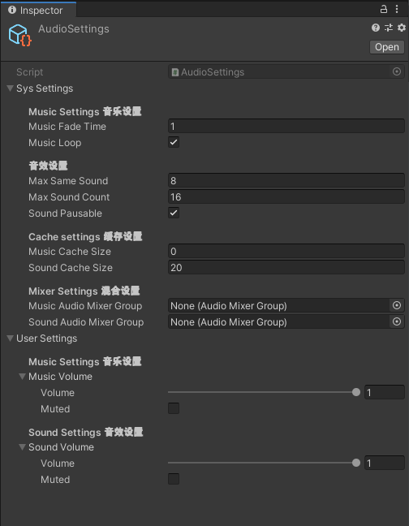
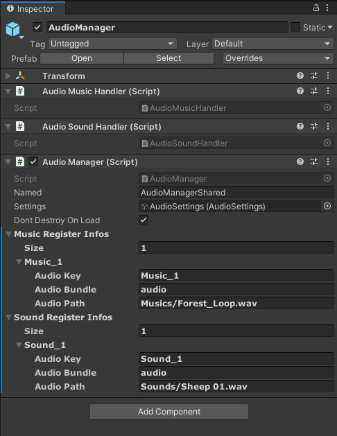
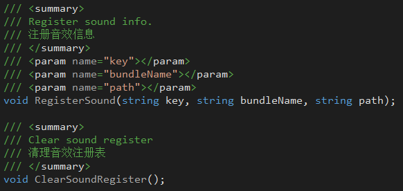
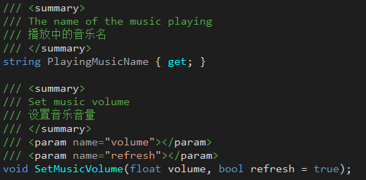
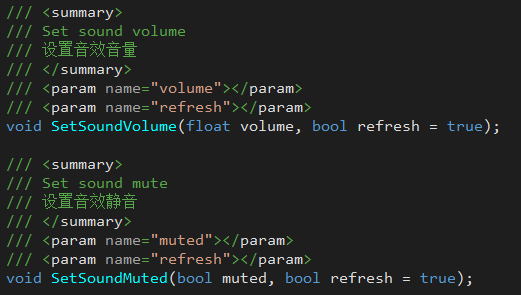

## 5. Audio Manager (AudioManager)
The perfect audio management module supports scene and UI music sound effects, and removes the dependency of Assetbundle.  

+ **JLGames.GameDriver.Actions.Audio** provides full functional support for audio management.
+ Audio loading uses the default loader (Loader), but also supports custom loader.
+ Use Ico method to inject audio resource information.
+ There is no need to directly reference audio resources, which realizes the separation of resource usage and resource packaging.
+ Support cache settings to reduce loading consumption.

### 5.1 Initialization

#### 5.1.1 Generate configuration assets
Execute menu "Tools -> GameDriver -> Project -> Gen AudioSettings".  
The AudioSettings.asset (renameable) file will be generated under the project Assets/Resources.  
  
+ SysSettings are system-level settings and cannot be modified by users.
+ UserSettings are user-level settings, open to AP modification. I

#### 5.1.2 Setting up management objects
Copy GameDriver/Assets/AudioManager/Prefabs/AudioManager.prefab to the project initialization scene, and re-associate AudioSettings.asset  
  
+ Dont Destroy OnLoad whether to save the object when the scene is destroyed
+ Music Register Infos Music information preprocessing registry
+ Sound Register Infos Sound effect information preprocessing registry

#### 5.1.3 Set the audio loader:
````C#
AudioManagerPool.Shared.SetLoaderAdapter(new AudioLoader());
````
If you need to customize the loading, you can implement the IAudioLoader interface.  

### 5.2 Use

#### 5.2.1 Register audio information (optional)
Audio information can be registered in the script using the AudioManager function  
  
  

#### 5.2.2 Play music, play sound effects
+ Functions starting with SwitchMusic in AudioManger provide support for playing music.
+ Functions starting with PlaySound in AudioManager provide support for playing sound effects.
+ The playback of music sound effects supports direct playback without registration.

#### 5.2.3 Audio Settings
+ AudioManager supports music mute and volume settings.
  
+ AudioManager supports audio mute and volume settings.
  

#### 5.2.4 It is recommended to use packaged components, such as:
AudioDemoMusicNode and AudioDemoSoundNode components in the example.  

#### 5.3 Example
GameDriver/Samples/Audio  
  