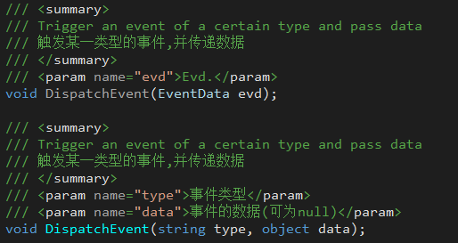
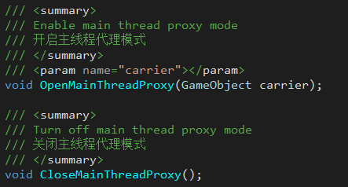

## 1. Event - Efficient event module, supports Unity multithreading
The event adopts the "**monitoring**-**capture**" mechanism, which supports the settings of the number of captures and capture priority during monitoring.  
+ **JLGames.GameDriver.CSharp.Event** is responsible for the core logic implementation of the event system.
+ **JLGames.GameDriver.Actions.ThreadEvent** provides support for multithreading.

### 1.1 Core functions - add listeners, remove listeners, dispatch events

#### 1.1.1 Monitoring
The `AddEventListener` series of functions in the interface IEventListener are used to add event listeners.  
The logic implementation has been completed in the implementation class EventDispathver.  
  

#### 1.1.2 remove monitor
The `RemoveEventListener` series of functions in the interface IEventListener are used to remove event listeners.  
The logic implementation has been completed in the implementation class EventDispathver.  
  

#### 1.1.3 Distributing events
The `DispatchEvent` series of functions in the interface IEventDispatcher are used to distribute events.  
The logic implementation has been completed in the implementation class EventDispathver.  
  

#### 1.1.4 Multithreading support
The functions declared in the interface IThreadEventProxy define the multithreading support specification.  
The logic implementation has been completed in the implementation class ThreadEventDispatcher.  
  

#### 1.1.5 Extensions
Extends EventDispathver or ThreadEventDispatcher and implements a custom interface that can be used to extend event behavior.  

### 1.2 Example
GameDriver/Samples/Event  
  